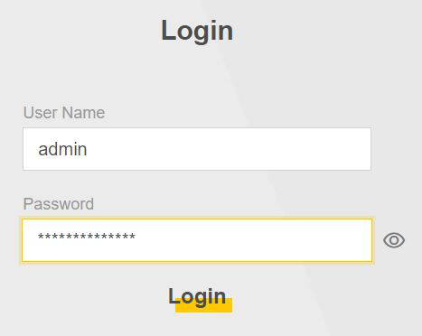

# Zyxel Router: Bitwarden Autofill Fix

---

## 💡 Why I Made This Script

Zyxel routers (such as the EX7710-B0 and EX5601-T0) have a frustrating issue:
when using **Bitwarden** (or similar password managers), the router’s login page often **deletes or corrupts the autofilled password**.

This leads to errors like:

* “The username or password is not correct or locked.”
* “Length of password is from 4\~64.”

This script makes Bitwarden autofill work reliably on Zyxel router login pages.

---

## ✨ Features

* **Keeps passwords stable**: Prevents Zyxel’s UI from wiping out autofilled passwords.
* **Works with SPA login pages**: Handles redirects (`/ → /login`), re-renders, and logout flows.
* **Bitwarden-friendly**: Uses the exact password Bitwarden fills — nothing is stored or altered.
* **Compatible models**: Confirmed on EX7710-B0 and EX5601-T0; likely works with other Zyxel routers too.
* **Lightweight & safe**: No external calls, no saved data, no special permissions.

---

## 📥 Installation

1. Install a userscript manager if you don’t already have one:

   * [Tampermonkey](https://www.tampermonkey.net/) (recommended)
   * [Violentmonkey](https://violentmonkey.github.io/)
   * [Greasemonkey](https://www.greasespot.net/) (not as well tested)

2. Install this script from [Greasy Fork](https://greasyfork.org/en/scripts/XXXXX-zyxel-bitwarden-autofill-fix).

3. Open your router’s login page (e.g. `http://192.168.1.1/`) and let Bitwarden autofill your credentials.

   * Click **Login** (or press Enter) — the script ensures the password is submitted correctly.

---

## ⚙ How It Works

* Keeps the unmasked password field visible so Bitwarden’s autofill stays intact.
* Listens for autofill events and remembers the value only in page memory.
* Just before login (button click or Enter key):

  * Copies the password into all fields Zyxel’s code might read.
  * Fires `input`, `keyup`, and `change` events so validation runs normally.
* Works even when Zyxel’s single-page app re-renders the login form.

---

## ✅ Known Working Models

* Zyxel **EX7710-B0**
* Zyxel **EX5601-T0**

> If you confirm this script works on other Zyxel models, feel free to share so they can be added here.

---

## License

This project is licensed under the [GNU General Public License v2.0](LICENSE).

---

Developed with ❤️ by [Brandon Henness](https://github.com/brandonhenness)
